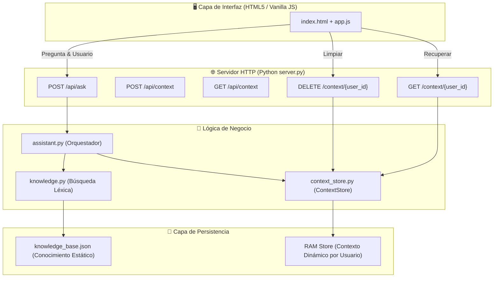

# CAG Lab — Módulo 3: Examen Final

Este proyecto es una plataforma interactiva experimental para el aprendizaje y evaluación de arquitecturas de IA que combinan **RAG (Retrieval-Augmented Generation)** con memoria contextual de usuario mediante **CAG (Context-Augmented Generation)**.

---

## 🚀 Arquitectura del Sistema (RAG + CAG)

El sistema integra conocimiento estático e histórico dinámico para producir respuestas personalizadas.



---

## 🛠️ Instalación y Configuración

### Prerrequisitos
*   **Python 3.10+** instalado en el sistema.

### Configuración del entorno
1. Clonar el repositorio y acceder a la carpeta del proyecto.
2. Iniciar el servidor backend:
   ```bash
   PYTHONPATH=. python3 -m backend.server
   ```
   El servidor quedará a la escucha en `http://127.0.0.1:8000`.

3. Abrir el frontend:
   *   Simplemente abre [`frontend/index.html`](file:///home/carlo/Documents/GitHub/final_project_AI_CUSTOM/frontend/index.html) en cualquier navegador web.

---

## 🔌 Referencia de la API (Endpoints)

| Método | Endpoint | Descripción | Payload / Parámetros | Respuesta (200 OK) |
| :--- | :--- | :--- | :--- | :--- |
| **POST** | `/api/ask` | Consulta al asistente combinando RAG + CAG | `{"user_id": "str", "question": "str"}` | `{"answer": "...", "sources": [...], "context_used": [...]}` |
| **POST** | `/api/context` | Guarda una clave de contexto para el usuario | `{"user_id": "str", "key": "str", "value": "any"}` | `{"saved": true}` (201 Created) |
| **GET** | `/context/{user_id}` | Obtiene todo el historial de contexto en formato JSON | Path variable `{user_id}` | `{"user_id": "...", "context": [{"key": "...", "value": "..."}]}` |
| **DELETE** | `/context/{user_id}` | Borra todo el historial de contexto de un usuario | Path variable `{user_id}` | `{"status": "cleared", "user_id": "..."}` |
| **GET** | `/health` | Chequeo de salud del servicio | Ninguno | `{"status": "ok"}` |

---

## 🧪 Ejecución de Pruebas

El proyecto cuenta con suites de pruebas unitarias y de integración.

### 1. Pruebas de Validación / Contrato (Oficiales del examen)
Valida el cumplimiento de las especificaciones funcionales solicitadas en la evaluación:
```bash
./test.sh
```
*(O directamente ejecutando: `PYTHONPATH=. python3 tests/validation/test_cag_contract.py`)*

### 2. Pruebas Unitarias del Almacén de Contexto
```bash
PYTHONPATH=. python3 -m pytest tests/unit/test_context_store.py
```

### 3. Pruebas Base de RAG
```bash
./scripts/run_base_tests.sh
```

---

## 📂 Estructura de Carpetas

```
final_project_AI_CUSTOM/
├── backend/
│   ├── assistant.py       # Orquestación de lógica RAG
│   ├── cag.py             # Lógica de aplicación de contexto (placeholder)
│   ├── context_store.py   # Almacenamiento thread-safe de contexto en RAM (CAG)
│   ├── knowledge.py       # Algoritmo de recuperación de fragmentos (RAG)
│   └── server.py          # Enrutamiento HTTP y endpoints del servidor
├── data/
│   └── knowledge_base.json # Documentos estáticos de soporte del curso
├── docs/
│   └── evidencias/        # Capturas y reportes requeridos
├── frontend/
│   ├── app.js             # Lógica e integración con la API del backend
│   ├── index.html         # Interfaz de usuario interactiva
│   └── styles.css         # Estilos visuales del cliente web
├── scripts/
│   ├── run_base_tests.sh  # Ejecución de pruebas básicas
│   └── validate_student_cag.sh # Validador del contrato de CAG
├── tests/
│   ├── base/              # Tests iniciales del RAG estático
│   ├── features/          # Archivos Gherkin (BDD) y arquitectura de soporte
│   ├── unit/              # Tests unitarios del módulo ContextStore
│   └── validation/        # Pruebas de validación del contrato del examen
├── test.sh                # Punto de entrada de validación del proyecto
└── README.md              # Documentación técnica general
```
