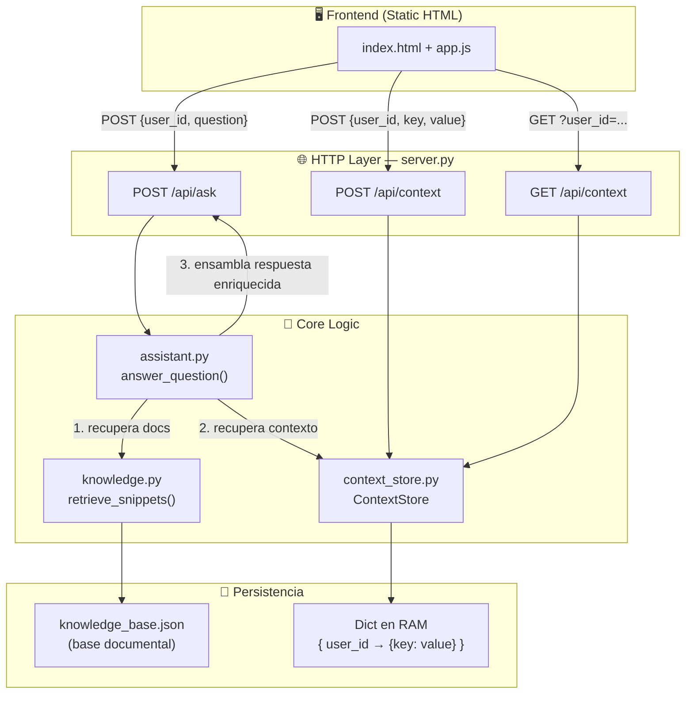

# Arquitectura del Módulo CAG
**Proyecto:** Examen Final Módulo 3 — CAG Lab  
**Alcance:** Diseño, sin implementación

---

## 1. Diagrama de Componentes



---

## 2. Responsabilidad de cada componente

| Componente | Archivo | Responsabilidad única |
|---|---|---|
| **HTTP Router** | `server.py` | Recibe requests, valida campos obligatorios, delega a los módulos correctos, serializa respuestas JSON |
| **Assistant** | `assistant.py` | **Orquestador**: combina snippets RAG + contexto CAG → construye la respuesta final; decide qué claves de contexto son relevantes |
| **RAG Engine** | `knowledge.py` | Recuperar los fragmentos documentales más relevantes para la pregunta (scoring léxico) |
| **Context Store** | `context_store.py` | Guardar y recuperar pares `key/value` por `user_id`; es el único componente que toca el almacenamiento de contexto |
| **Knowledge Base** | `data/knowledge_base.json` | Fuente de verdad documental estática; solo se lee, nunca se escribe en runtime |
| **Context Storage** | Dict en RAM | Estado en memoria que vive mientras el servidor esté levantado; aislado por `user_id` |

> **Principio clave:** `ContextStore` es el único que conoce *cómo* se guarda el contexto.  
> `assistant.py` solo sabe *qué* pedir, no *dónde* vive.

---

## 3. Cómo interactúa CAG con el RAG existente

El flujo actual (RAG puro) y el flujo objetivo (RAG + CAG) son:

### Flujo actual — RAG solo
```
pregunta
   └─► retrieve_snippets(question)        → snippets del KB
         └─► "Según la base de conocimiento: {snippets}"
               context_used = []           ← siempre vacío
```

### Flujo objetivo — RAG + CAG
```
(user_id, pregunta)
   ├─► retrieve_snippets(question)        → snippets del KB        [RAG]
   └─► context_store.list_for_user(uid)  → contexto del usuario    [CAG]
         │
         ▼
   assistant ensambla:
   "Contexto del usuario: {contexto relevante}.
    Según la base de conocimiento: {snippets}.
    Respuesta adaptada: ..."
         │
         ▼
   context_used = ["audience", "nivel", ...]   ← claves CAG usadas
```

### Regla de prioridad de ensamblado

```
RESPUESTA FINAL =
   [Prefijo CAG — adapta el tono/audiencia si existe contexto]
 + [Cuerpo RAG  — conocimiento documental recuperado]
 + [Cierre      — referencias a sources del KB]
```

El **contexto CAG va primero** porque condiciona cómo se presenta el conocimiento RAG, no lo reemplaza.

---

## 4. Estrategia de persistencia — Recomendación

### Comparativa para este alcance

| Opción | Complejidad | Persistencia entre reinicios | Dependencias externas | Recomendado |
|---|---|---|---|---|
| **Dict en RAM** | ⭐ Mínima | ❌ No | Ninguna | ✅ **Para este examen** |
| SQLite (archivo) | ⭐⭐ Baja | ✅ Sí | `sqlite3` (stdlib) | Si piden persistencia real |
| Redis | ⭐⭐⭐ Media | ✅ Sí | Servidor externo | Overkill para este alcance |

### Recomendación: **Dict en RAM**

**Estructura interna del ContextStore:**
```
_store = {
    "ana":  { "preferred_style": "analogias", "project": "monolito" },
    "luis": { "audience": "principiante" },
    "maria":{ "nivel": "avanzado" }
}
```

**Por qué es suficiente:**
- El contrato de tests no exige persistencia entre reinicios del servidor
- `ThreadingHTTPServer` crea **un único proceso** — el dict compartido es thread-safe para lecturas; `save()` puede protegerse con `threading.Lock` si se quiere rigor
- Cero dependencias nuevas — el proyecto no tiene `requirements.txt` con librerías externas
- `list_for_user()` devuelve `[{"key": k, "value": v}, ...]` — lista de dicts, que es exactamente lo que `test_retrieves_context_for_user` verifica en línea 69

### Interfaz pública requerida (contrato)

```
ContextStore.save(user_id, key, value) → bool
  - Hace upsert: si la key existe, reemplaza el valor
  - Retorna True si se guardó correctamente

ContextStore.list_for_user(user_id) → list[dict]
  - Retorna [{"key": k, "value": v}, ...] para ese user_id
  - Retorna [] si el usuario no tiene contexto
```

---

## 5. Decisiones de diseño

| Decisión | Opción elegida | Justificación |
|---|---|---|
| **¿Cómo filtra `assistant.py` el contexto?** | Usa **todo** el contexto del usuario | Más simple; pasa los tests del contrato |
| **¿Qué pasa si no hay contexto?** | Respuesta solo con RAG | Mantiene compatibilidad con `test_base_api.py` |
| **¿Thread-safety?** | Sin lock | Válido para alcance de examen |
